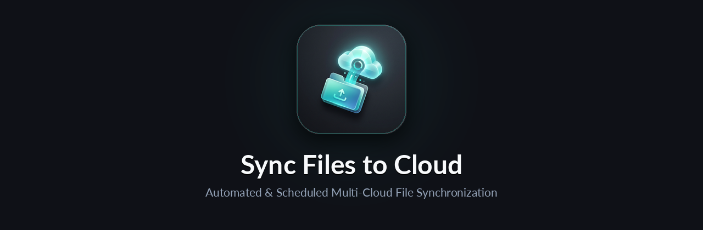

<p align="center">
  
</p>

<p align="center">
  
  
  
  
</p>

<p align="center">
  <em>A Python-based application that automatically synchronizes local folders to cloud storage providers on a scheduled basis.</em>
</p>

---

## Features

- **Automatic Synchronization**: Schedule periodic uploads of local folders to cloud storage
- **Multiple Folders**: Configure multiple folders with different sync intervals and settings
- **File Compression**: Optionally compress files before uploading to save storage space
- **Exclude Patterns**: Define patterns to exclude specific files or folders from sync
- **Desktop Notifications**: Get notified when reconnection to cloud provider is needed
- **Logging**: Comprehensive logging system to track all sync operations

## Supported Cloud Providers

| Provider     | Status         | Documentation                                           |
|--------------|----------------|---------------------------------------------------------|
| Google Drive | ✅ Available   | [Setup Guide](documentation/connect-to-google-drive.md) |
| Git          | ✅ Available   | [Setup Guide](documentation/connect-to-git.md)          |
| Proton Drive | ✅ Available   | [Setup Guide](documentation/connect-to-proton-drive.md) |
| OneDrive     | 🔜 Coming Soon | -                                                       |
| Dropbox      | 🔜 Coming Soon | -                                                       |

## Installation

1. Prerequisites

- Python 3.8 or higher

<br>

2. Get the code:

**Option A: Clone the repository**

```bash
git clone <repository-url>
cd sync-files-to-cloud
```

**Option B: Download from releases**

- Go to the [Releases page](https://github.com/MathieuMarthy/sync-files-to-cloud/releases)
- Download the latest release (Source code.zip or Source code.tar.gz)
- Extract the archive and navigate to the folder

<br>

3. Create and activate a virtual environment:

```bash
# Create virtual environment
python -m venv venv
```


4. Activate virtual environment
#### On Windows:
```powershell
venv\Scripts\activate
```
#### On macOS/Linux:
```bash
source venv/bin/activate
```

5. Install required dependencies:

```bash
pip install -r requirements.txt
```

6. Set up cloud provider credentials:
    - For Google Drive: Follow the [Google Drive Setup Guide](documentation/connect-to-google-drive.md) (place your `gdrive_credentials.json` file in the `credentials/` folder)
    - For Git: Follow the [Git Setup Guide](documentation/connect-to-git.md) (place your `git_credentials.json` file in the `credentials/` folder)
    - For Proton Drive: Follow the [Proton Drive Setup Guide](documentation/connect-to-proton-drive.md) (official CLI or optional Rclone setup)


## Configuration

Edit the `config.yaml` file to configure your synchronization settings:

```yaml
logging:
  level: "INFO"
  file_path: "app.log"

sync:
  - name: my_images
    cloud_provider: "GoogleDrive"
    sync_interval: 60  # in minutes
    compress: true
    local_path: "C:/Users/Username/Documents/Images" # Absolute path to local folder. Can be a string or a list of strings
    remote_path: "/images"
    exclude_patterns: # work like a .gitignore file
      - "*.tmp"
      - "temp_folder/*"
```

Other exemple with multiple local paths and exclude patterns:

```yaml
local_path:
  - "/home/user/.config"
  - "/home/user/.oh-my-zsh"

exclude_patterns:
  - "*"
  - "!neofetch"
  - "!kitty"
  - "!custom/themes"
  - "!nvim"
```

### Configuration Options

- **name**: Unique identifier for the sync folder
- **cloud_provider**: Cloud storage provider ("GoogleDrive", "Git", or "ProtonDrive")
- **sync_interval**: Time between syncs in seconds
- **compress**: Whether to compress files into a zip archive before upload
- **local_path**: Absolute path to the local folder to sync
- **remote_path**: Destination path in the cloud storage
- **exclude_patterns**: List of patterns to exclude files (supports wildcards like `*.tmp`, `folder/*`)

⚠️ If you change the configuration while the application is running, you need to restart it to apply the changes.  
*See the 'usage' section for commands to restart the application depending on your OS.*

## Usage

Run the application:

```bash
python main.py
```

The application will:

1. Initialize connections to configured cloud providers
2. Perform an initial sync for all configured folders
3. Schedule periodic syncs based on the configured intervals
4. Continue running until stopped (Ctrl+C)

### Running at Startup

To automatically run the script when your computer starts:

<details>
<summary>Windows Instructions</summary>

1. Setup the powershell script

Go in the `/scripts` folder, open `activate-scheduled-task.ps1`and edit the line 3:

```powershell
$projectPath = "path to the project" # Put the absolute path to this project
```

2. Run the script as administrator

open a powershell terminal as administator and run

```powershell
path/to/activate-scheduled-task.ps1
```

⚠️ *If you have issues running the script due to execution policies, you can right-click on the script → Properties →
Unblock → Apply. Then try running it again.*

<br>

#### To deactivate the scheduled task

you can run the deactivation script `scripts\remove-scheduled-task.ps1`

#### To restart the application

you can run the restart script `scripts\restart-scheduled-task.ps1`

#### Start the application through the Task Scheduler

```powershell
Start-ScheduledTask -TaskName "Sync-files-task"
```

#### Stop the application through the Task Scheduler

```powershell
Stop-ScheduledTask -TaskName "Sync-files-task"
```

</details>


<details>
<summary>Linux Instructions (systemd)</summary>

1. Create a systemd service file `/etc/systemd/system/sync-files.service`:

don't forget to replace the paths and username

```ini
[Unit]
Description = Sync Files to Cloud
After = network.target

[Service]
; replace the paths below with the project path
ExecStart = /path/to/sync-files-to-cloud/venv/bin/python /path/to/sync-files-to-cloud/main.py
WorkingDirectory = /path/to/sync-files-to-cloud
; Replace 'your-username' with the appropriate user
User = your-username
Restart = on-failure

[Install]
WantedBy = multi-user.target
```

2. Enable and start the service:

```bash
sudo systemctl enable sync-files.service
sudo systemctl start sync-files.service
```

<br>

#### Deactivate the service

To stop and disable the service:

```bash
sudo systemctl stop sync-files.service
sudo systemctl disable sync-files.service
```

#### Restart the application

To restart the service:

```bash
sudo systemctl restart sync-files.service
```

</details>

## How It Works

1. **Configuration Loading**: The application reads `config.yaml` to load sync parameters
2. **Cloud Authentication**: Connects to cloud providers using credentials from the `credentials/` folder
3. **File Discovery**: Scans local folders and filters files based on exclude patterns
4. **Compression** (optional): Compresses files into a zip archive
5. **Upload**: Uploads files to the cloud provider while preserving folder structure
6. **Scheduling**: Repeats the process at configured intervals
7. **Error Handling**: If connection fails, sends desktop notification to reconnect

## Troubleshooting

### Files Not Syncing

- Check that the local path exists and is accessible
- Verify exclude patterns are not blocking desired files
- Review logs in `app.log` for detailed error messages

## Contributing

Contributions are welcome! Please feel free to submit pull requests or open issues.
