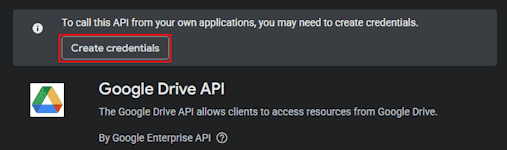

### Connect "sync-files" to Google Drive
 

#### 1. Create a project on Google Cloud Platform
you can follow the offical [tutorial](https://developers.google.com/workspace/drive/api/quickstart/python) or follow the steps below:

##### Create the project
- Create a project on Google Cloud Platform: [Create Project](https://console.cloud.google.com/projectcreate) name it "sync-files" or any name you like.

#### Enable the Google Drive API and create credentials
- Activate the Google Drive API: [Enable Google Drive API](https://console.cloud.google.com/marketplace/product/google/drive.googleapis.com)
- Once the API is activated, click on the "Create Credentials" button.

- Select "Google Drive API" and "User Data", fill the form with your information
- In the scopes section, add the `../auth/drive.file` scope
- The `OAuth Client ID` must be set to "Desktop App"
- Download the `credentials.json` file and click done

#### Add users to the project
- On the [Audience screen](https://console.cloud.google.com/auth/audience) add a test user with your email address
